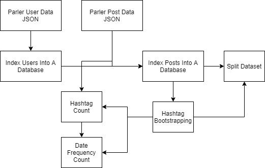

# Parler Toolbox 🔎 
A repository of scripts and tooling for the processing of Parler social media data for the purpose of academic research. This scripts in this repository may be rough around the edges as they've been designed as quick approaches to achieve a specific task.

## 📈 Tooling Structure 



## 📄 Parler Data 
The tooling in this repository is not designed to actively scrape or harvest data from the Parler social network, instead it builds of the research (and dataset provided) by Aliapoulios et al - called [An Early Look at the Parler Online Social Network](https://arxiv.org/pdf/2101.03820.pdf). The data provided by this research is broken down into two sets of json files; users and posts. Each set includes multiple Json files that contain several of each set.

An example **User** entry may be as follows
```JSON
{
   "comments":14,
   "body":"Hope everyone has a great day",
   "bodywithurls":"Hope everyone has a great day ",
   "createdAt":"20200804233802",
   "createdAtformatted":"2020-08-04 23:38:02 UTC",
   "datatype":"posts",
   "depth":0,
   "depthRaw":0,
   "followers":36000,
   "following":60000,
   "username":"SomePerson",
   "verified":false,
}
...
```

An example **Post** may be as follows:

```JSON
{
   "comments":2,
   "body":"Hello World",
   "bodywithurls":"Hello World\n",
   "createdAt":"20200615225113",
   "createdAtformatted":"2020-06-15 22:51:13 UTC",
   "datatype":"posts",
   "depth":7,
   "depthRaw":7,
   "followers":709,
   "following":808,
   "username":"A User",
}
...
```

The tooling in this repository is designed for the processing of this data, however, could be extended to work with the Parler API directly.

## 📝 Indexing Data 
As previously mentioned the data used by this tooling is formatted in JSON, this can mean that the mass processing of this data will be highly inefficient, especially if cross referencing between posts and users. Due to this several scripts have been created to reformat this data.

### 👤 Create a User Database 
**Script:** *Create_User_Database.py*

Once updating the ```user_folder``` variable to a folder containing all of the Parler users, this script will iterate through all users and create a database file with the table ```parler_users```. Inside of this table all users will be aggregated with the following fields: ```username```, ```follow_freq```, ```post_freq```. This tooling could be extended to include additional fields from the Parler data.

### 📬 Create A Post Database 
**Script:** *Body-Aggregator.py*

Once provided with the name of the create Parler username database (via the ```user_db``` variable) and the folder of Parler posts (via the ```folder_of_data```) variable, this tooling will process all Parler posts and add them to a database called ```parler-messages.db``` with a single table called ```parler_messages``` and fields: username, body, follow_freq, post_freq, and Time. This tooling could be extended to include additional fields from the Parler data.

## 🕵️ Analysing Data 

### 📣 Hashtag Bootstrapping 
**Script:** *hashtag-bootstrapping.py*

This tooling iterates over the Parler data, aggregating a list of used hashtags attributed to a subset provided.  This script iterates through all Parler post bodies looking for a root (or series of root) hashtags. Hashtags in the posts containing this root hashtag are stored until all messages have been processed. The process is then continued with this new list of hashtags. The goal is to create a corpus of related hashtags. 

This script is provided with a ```depth_range``` variable (the number of times the tooling will use a new list of root hashtgs), a ```depth_range``` hashtag (providing how many attributed hashtags to store each depth), a ```search_hashtags``` list variable (including strings of the initial root hashtags), and the name of the aforementioned post database (via the ```db``` variable. This script produces a file called ```output-hashtags.txt``` which contains the most related hashtags to all root hashtags.

### 📅 Date Frequency (via extremist posts v.s non-extremist posts) 
**Script:** *date-freq.py*

This tooling iterates over the Parler posts and identifies the frequency of extremist vs.. non-extremist using the hashtags previously obtained (where if 10% of a post or more is made up of the hashtags it's deemed as extremist). This tooling takes the name of the folder where the Parler Json posts are (via the ```folder_of_data``` variable), and the previously created list of hashtags via the ```output_file``` variable. This tooling could easily be used to distinguish between other factors. This tooling creates a JSON file called ```date-freq.json``` which contains the frequencies, an example output can be seen below:

```JSON
  "2020-8": {
    "total": 7178205,
    "extreamist": 1138631,
    "non-extreamist": 6039574
  },
...
```

#### 🗓️ Checking Date Frequency 
**Script:** *calculate-final-date-freq.py*

An additional piece of tooling has been created that reads the aforementioned JSON file and returns the total percentage frequency of each category of post. This script must be provided with the path to the ```date-freq.json``` file. An example output:

```
The average frequency of extremist posts per month on Parler is: '17.053122995214466%', with average non-extremists: '82.94687700478552%'
```

### 🧮 Hashtag Count 
**Script:** *count-hashtags.py*

This tooling iterates through the Parler post Json files (set in the ```folder_of_data``` variable) and counts all occurrences of the hashtags in the  ```output-hashtags.txt```file (set in the ```output_file``` variable). This tooling creates a sorted JSON file of all occurrences of the number of times each hashtag occurred (called ```hashtag-count.json```).

### ✂️ Splitting Data 
**Script:** *split-dataset.py*

Tooling has also been created for the splitting posts into two separate CSV files depending on if the post contains at least 10% of the hashtags included in a text file. 
This tooling is provided the ```output-hashtags.txt``` file via the ```keywords_location``` variable and the location of the Parler post database via the ```db``` variable. This tooling creates the files ```extreamist-messages.csv``` and ```non-extreamist-messages.csv```.
